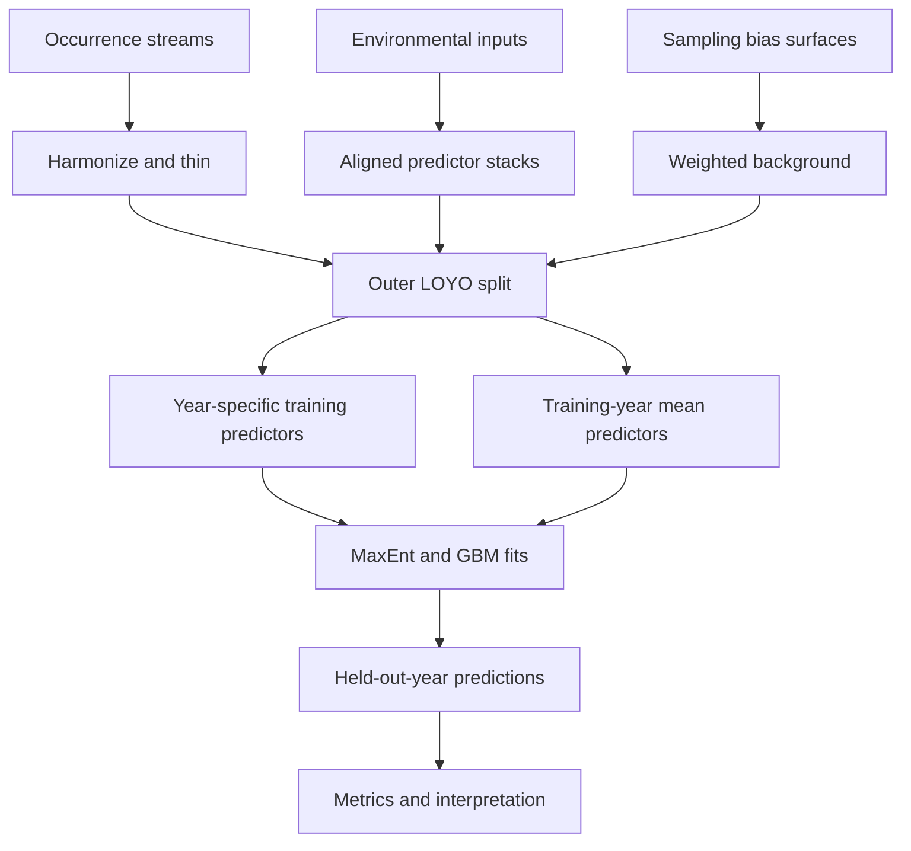

# Methods and implementation

[Documentation home](README.md) · [Manuscript crosswalk](MANUSCRIPT_CROSSWALK.md) · [Reproduction status](REPRODUCIBILITY.md)

## Scientific question

The study asks whether retaining interannual environmental variation improves transfer to unseen years relative to an average-year baseline, and how adding road and rail collisions to GBIF changes habitat-suitability estimates. MaxEnt and LightGBM provide alternative presence-background learners. Engine comparison is secondary to temporal representation and occurrence-stream comparisons.

The outputs describe **relative habitat suitability with respect to the sampled background**. They do not estimate absolute abundance, calibrated probability of occurrence, or the probability of a wildlife-vehicle collision. Differences between occurrence-stream scenarios can reflect sampling processes as well as ecological information.

## Processing responsibilities

The diagram describes the study workflow, not a claim that one command regenerates every upstream product. Land-cover model training, some bias-surface construction and input acquisition require separately prepared assets. Inner tuning is discussed separately below.

## Occurrences and seasonal labels

GBIF observations, RRN roadkill and SNCF rail collisions are complementary presence streams. The supplement's S1 describes coordinate/date quality filtering, one-record-per-grid-cell deduplication and environmental-space thinning. Core thinning routines live in [thinning.py](../scripts/thinning.py), with raster-cell deduplication in [utils.py](../scripts/utils.py). Prepared source tables and original cleaning records are not bundled.

Summer is March-August. Winter is September-February and is labelled by the starting year: Winter 2023 includes September 2023-February 2024. Reviewed configs cover seven winters (2017-2023) and six summers (2018-2023). [The loader](../scripts/multitemporal.py) filters existing year/season columns; it does not reconstruct those labels from raw dates.

Thinning settings are source/year-specific. Percentages are configuration controls, not proof of final retention: filtering, nodata and deduplication can affect final counts. Use saved occurrence audits when checking manuscript Table 1.

## Background and observation bias

The study describes source-specific surfaces based on GBIF accessibility, road traffic and railway traffic, combined for relevant scenarios (S2; Fig. 3). [bias_grid.py](../scripts/bias_grid.py), [background_sampling.py](../scripts/background_sampling.py) and the temporal runners consume or combine prepared bias inputs. These utilities are not a complete substitute for the upstream traffic and accessibility workflow.

Reviewed examples request 15,000 background points per year. A background point describes environmental availability; it is not a verified absence. Inspect the configured source-specific bias pattern and strength when changing occurrence streams. Bias-aware sampling reduces particular observation biases; it does not establish that all bias has been removed. CBI is an evaluation metric, not a bias-correction procedure.

## Predictors and feature selection

The model grid is Lambert-93 (EPSG:2154), at 1 km resolution. Input products have different native resolutions and units. The ViT-derived annual 30 m land-cover maps are processed into fractions and distance features before SDM fitting. See [Predictors](PREDICTORS.md) for the six manuscript domains and data guides.

[preprocessing.py](../scripts/preprocessing.py) builds aligned inputs; [variable_selection.py](../scripts/variable_selection.py) and the temporal runners implement correlation/VIF selection and feature handling. [featureconfig.yaml](../configs/features/featureconfig.yaml) supplies keep/drop and grouping rules. A permitted candidate can still be removed by redundancy pruning. Preserve the actual selected names and order for every saved model.

The hunting correction enables hunting as a **winter candidate** for both temporal modes. It does not force hunting through VIF/correlation pruning. Summer configurations keep it disabled. The [review package](../review/README.md) audits source availability, stack inclusion and final retention separately.

## Temporal representation

| Representation | Training data | Held-out projection |
|---|---|---|
| Multitemporal | Annual training-year predictors remain distinct | Corresponding test-year predictors |
| Monotemporal | Predictors averaged over training years | Corresponding test-year predictors |

[multitemporal.py](../scripts/multitemporal.py) uses synthetic raster offsets to arrange annual predictors into a combined training layout. `shift_km` controls that layout, not ecological distance. [monotemporal.py](../scripts/monotemporal.py) builds the training-year mean representation. Both use the `multitemporal` config section, and both execute LOYO rotations.

## Tuning and evaluation

Manuscript Methods, lines 347-358, describe Optuna tuning inside training data with spatial blocking and an outer **temporal** LOYO test. An outer held-out year is not an independent spatial holdout. No independent within-year spatial test is claimed by that design.

The public LOYO meta runners invoke seasonal fits using supplied parameters. They do not automatically run the whole nested tuning protocol. Separate tuning scripts differ in their objective data and fold construction; see the concrete [tuning audit](REPRODUCIBILITY.md#tuning-and-outer-evaluation). Do not infer nested tuning from a config filename, a disabled CV block, or a post-hoc spatial diagnostic on a best-performing fold.

[evaluation.py](../scripts/evaluation.py) provides CBI and AUC diagnostics. CBI evaluates relative ranking of presence predictions against available environmental predictions; AUC discriminates presences from sampled background. Neither metric directly validates abundance or collision risk.

## Interpretation products

- **Relative suitability maps:** Fig. 6 and S8. Compare the same grid, mask, year and scenario; see [engine output scales](gbm_maxent_alignment.md).
- **Differences between occurrence streams:** Fig. 7. Preserve subtraction direction and legend; spatial changes alone do not establish better spatial accuracy.
- **Permutation importance:** Tables 4-5 and S6b. The manuscript specifies five permutations on held-out data, aggregated across available years. Existing helpers differ in fold/split coverage; see [Outputs](OUTPUTS.md#feature-importance).
- **Response curves:** S7. One predictor varies while others are held at their means. They describe fitted associations, not isolated causal effects.
- **Environmental novelty:** Fig. 8 and S9. MESS < 0 identifies marginal-range novelty (NT1). NT2 uses a Mahalanobis-based reference; its normalization threshold must be recorded explicitly because current defaults differ from the manuscript wording.

This documentation update does not alter fitted algorithms or regenerate research results. It makes the available implementation and required provenance explicit.
